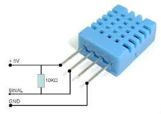

#Sensor DHT11

##Configuración del hardware

Para la utilización del DHT11 tendremos que poner una resistencia de 10k entre los pines
uno y dos mirando el sensor desde la parte que vemos la rejilla, siendo la patilla 1 la de la
izquierda.
La alimentación es la patilla 1 y 4, Vcc -> 1 y GND -> 4, siendo ésta de 3.3V
La patilla 2 la llevamos al pin 4 de la raspberry que en la placa es el pin 7



##Configuración del software y ejecución

Para utilizarlo usaremos las librerias de Adafruit en python, aunque alternativamente veremos un programa
en C con el que también podremos usar el sensor

Instalación de librerias de Adafruit:

```

git clone https://github.com/adafruit/Adafruit_Python_DHT.git
cd Adafruit_Python_DHT
sudo apt-get update
sudo apt-get install build-essential python-dev python-openssl
sudo python setup.py install

cd examples
sudo ./AdafruitDHT.py 11 4

```

Con los ultimos dos comandos podemos probar el funcionamiento del sensor, que nos debe devolver

```

Temp=28.0*C  Humidity=29.0%

```

##Software en C y ejemplo de web para mostrar temperaturas

Instalamos la libreria para C wiringPi y la compilamos

```

sudo apt-get install git-core build-essential
git clone git://git.drogon.net/wiringPi
cd wiringPi
./build

```

Creamos un programa en C con el nombre DHT11.c con el siguiente código:

```C

#include <wiringPi.h>
#include <stdio.h>
#include <stdlib.h>
#include <stdint.h>
#define MAX_TIME 85
#define DHT11PIN 7
#define ATTEMPTS 5
int dht11_val[5]={0,0,0,0,0};

int dht11_read_val()
{
  uint8_t lststate=HIGH;
  uint8_t counter=0;
  uint8_t j=0,i;
  for(i=0;i<5;i++)
     dht11_val[i]=0;
  pinMode(DHT11PIN,OUTPUT);
  digitalWrite(DHT11PIN,LOW);
  delay(18);
  digitalWrite(DHT11PIN,HIGH);
  delayMicroseconds(40);
  pinMode(DHT11PIN,INPUT);
  for(i=0;i<MAX_TIME;i++)   {
     counter=0;
     while(digitalRead(DHT11PIN)==lststate){
      counter++;
      delayMicroseconds(1);
      if(counter==255)
         break;
     }
     lststate=digitalRead(DHT11PIN);
     if(counter==255)
        break;     // top 3 transistions are ignored
     if((i>=4)&&(i%2==0)){
      dht11_val[j/8]<<=1;
     if(counter>16)
        dht11_val[j/8]|=1;
      j++;
    }
  }
  // verify checksum and print the verified data
  if((j>=40)&&(dht11_val[4]==((dht11_val[0]+dht11_val[1]+dht11_val[2]+dht11_val[3])& 0xFF)))
  {
    printf("%d.%d,%d.%d\n",dht11_val[0],dht11_val[1],dht11_val[2],dht11_val[3]);
    return 1;
  }
  else
    return 0;
}

int main(void)
{
  int attempts=ATTEMPTS;
  if(wiringPiSetup()==-1)
    exit(1);
  while(attempts)
  {
    int success = dht11_read_val();
    if (success) {
      break;
    }
    attempts--;
    delay(500);
  }
  return 0;
}

```
Compilamos el programa en C:

```

gcc -o DHT11 DHT11.c -L/usr/local/lib -lwiringPi

```
Una vez compilado vamos a crear una tarea que se ejecute cada minuto para tomar la temperatura, la cual guardaremos
en un archivo de texto

```

sudo crontab -e

```
Añadimos lo siguiente en crontab:


```

* * * * * echo `date +\%Y\%m\%d\%H\%M\%S`,`python /home/userpro/Project/DHT11.py 11 4` >> /home/userpro/Project/DHT11.log

```

Iniciamos crontab

```

sudo service cron start
sudo update-rc.d cron defaults

```

Instalamos NGINX para hacer de servidor web:

```

sudo apt-get install nginx

```

Y ahora creamos enlaces al archivo temporal:

```

sudo ln -s /home/userpro/Project/DHT11.log /var/www/html/DHT11.log

```


Nos descargamos el archivo javascript que genera las gráficas

```

sudo wget -P /var/www http://dygraphs.com/dygraph-combined.js

```

Creamos un html para hacer la petición al servidor y que nos muestre las gráficas:
```

sudo nano temp.html

```

Metemos el siguiente código:

```

<html>
<head>
<script type="text/javascript" src="dygraph-combined.js"></script>
</head>
<body>
<div id="graphdiv" style="width:750px; height:400px;"></div>
<script type="text/javascript">

  function addZero(num)
  {
    var s=num+"";
    if (s.length < 2) s="0"+s;
    return s;
  }

  function dateFormat(indate)
  {
    var hh = addZero(indate.getHours());
    var MM = addZero(indate.getMinutes());
    //var ss = addZero(indate.getSeconds());
    var dd = addZero(indate.getDate());
    var mm = addZero(indate.getMonth()+1);
    var yyyy = addZero(indate.getFullYear());
    return dd+'/'+mm+' '+hh+':'+MM;
  }

  g = new Dygraph(
    document.getElementById("graphdiv"),
    "DHT11.log",
    {
      xValueParser: function(x) {
        var date = new Date(x.replace(
          /^(\d{4})(\d\d)(\d\d)(\d\d)(\d\d)(\d\d)$/,
          '$4:$5:$6 $2/$3/$1'
        ));
        return date.getTime();
      },
      axes: {
        x: {
          ticker: Dygraph.dateTicker,
          axisLabelFormatter: function(x) {
            return dateFormat(new Date(x));
          },
          valueFormatter: function(x) {
            return dateFormat(new Date(x));
          }
        }
      },
      labelsDivWidth: 310,
      rollPeriod: 30,
      strokeWidth: 2.0,
      labels: ['Date','Humidity (%)','Temp (&deg;C)']
    }
  );
</script>
</body>
</html>


```

Ahora podemos hacer una petición a la ip de la raspberry, o desde ella misma, con el archivo temp.html y veremos
la gráfica

```

http://localhost/temp.html

```


##Bibliografia

http://carlini.es/sensores-de-humedad-y-temperatura-dht11-y-dth22-en-la-raspberry-pi/(DHT11 con libreria adafruit)
http://fpaez.com/sensor-dht11-de-temperatura-y-humedad/ (DHT11 sensor temperatura)
http://www.kbza.org/2013/06/13/monitor-de-temperatura-y-humedad-con-raspberry-pi/ (DHT11 con crontab y servidor visualizando temperaturas en C)

http://www.uugear.com/portfolio/dht11-humidity-temperature-sensor-module/ ()
http://www.uugear.com/portfolio/rasberrry-pi-reads-dht11-via-arduino/
http://www.uugear.com/uugear-rpi-arduino-solution/
